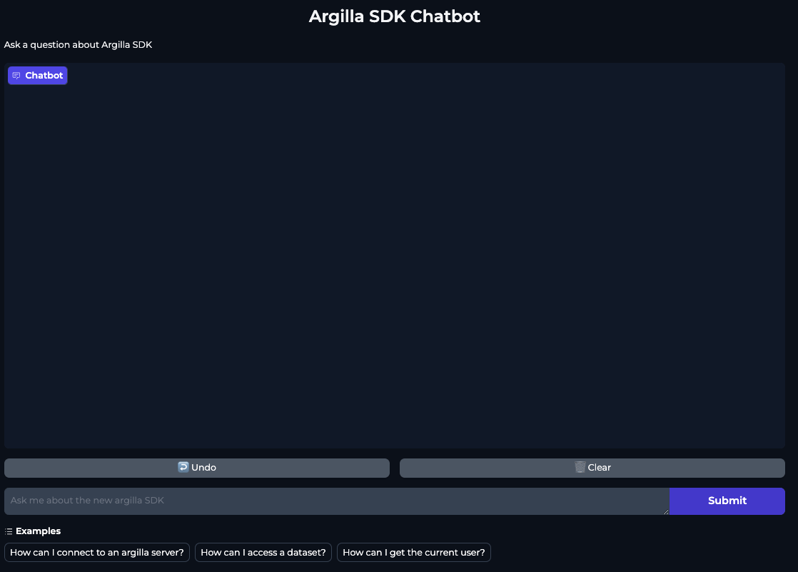
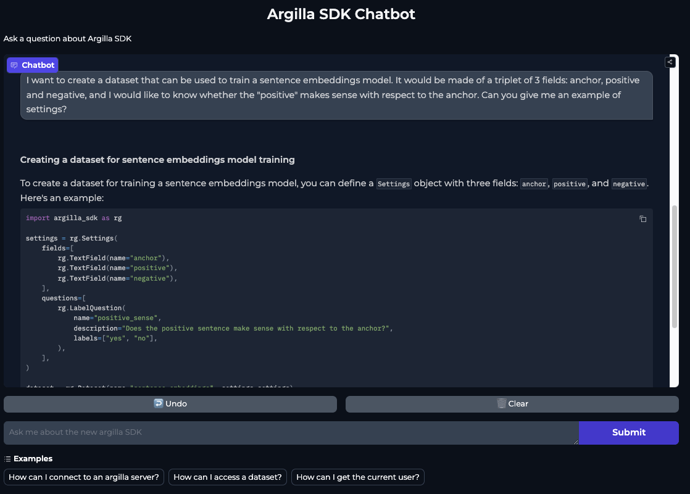

# Creating a chatbot for the new Argilla SDK: leveraging distilabel to fine tune a custom Embedding model for RAG

## TL;DR

**Summary/motivation goes here**.

If you prefer, you can skip click the next button.

<div class="container">
    
    <button id="btn">Go to app</button>
    <style>
        #btn {
            position: absolute;
            top: 50%;
            left: 50%;
            transform: translate(-50%, -50%);
            -ms-transform: translate(-50%, -50%);
            background-color: #4CAF50;
            color: white;
            font-size: 16px;
            padding: 12px 24px;
            border: none;
            cursor: pointer;
            border-radius: 5px;
            width: 30%;
            height: auto;
        }
    </style>
</div>

## Table of Contents

- [Generating Synthetic Data for Fine-Tuning Custom Embedding Models](#generating-synthetic-data-for-fine-tuning-custom-embedding-models)
    - [Downloading and chunking data](#downloading-and-chunking-data)
    - [Generating synthetic data for our embedding model using distilabel](#generating-synthetic-data-for–our-embedding-model-using-distilabel)
    - [Explore the datasets in Argilla](#explore-the-datasets-in-argilla)
        - [An Argilla dataset with chunks of technical documentation](#an-Argilla-dataset-with-chunks-of-technical-documentation)
        - [An Argilla dataset with triplets to fine tune an embedding model](#an-Argilla-dataset-with-triplets-to-fine-tune-an-embedding-model)
    - [Fine-Tune the embedding model](#fine-tune-the-embedding-model)
        - [Prepare the embedding dataset](#prepare-the-embedding-dataset)
        - [Load the baseline model](#load-the-baseline-model)
        - [Define the loss function](#define-the-loss-function)
        - [Define the training strategy](#define-the-training-strategy)
        - [Train and save the final model](#train-and-save-the-final-model)
- [The vector database](#the-vector-database)
    - [Connect to the database](#connect-to-the-database)
        - [Instantiate the fine tuned model](#instantiate-the-fine-tuned-model)
    - [Create the table with the documentation chunks](#create-the-table-with-the-documentation-chunks)
        - [Populate the table](#populate-the-table)
        - [Store the database in the Hugging Face Hub](#store-the-database-in-the-Hugging-Face-Hub)
- [Creating our ChatBot](#next-steps)
    - [The Gradio App](#the-gradio-app)
    - [Deploy the ChatBot app on Hugging Face Spaces](#deploy-the-chatbot-app-on-hugging-face-spaces)
    - [Playing around with our chatbot](#play-around-with-your-chatbot)    
- [Next Steps](#next-steps)

## Generating Synthetic Data for Fine-Tuning Custom Embedding Models

> TODO: Mention here the X message from PhilSchmid and blog on generating synthetic data

### Downloading and chunking data

Chunk the Data: Divide your text data into manageable chunks of approximately 256 tokens each (chunk size used in RAG later).

The first step consists on processing the documentation of your target repository. There are some libraries you can use out of the box to read the contents of a repository (like [llama-index](https://docs.llamaindex.ai/en/stable/examples/data_connectors/GithubRepositoryReaderDemo/)) and parse the markdown content (langchain has a [MarkdownTextSplitter](https://python.langchain.com/v0.1/docs/modules/data_connection/document_transformers/markdown_header_metadata/), and there's the [MarkdownNodeParser](https://docs.llamaindex.ai/en/stable/module_guides/loading/node_parsers/modules/?h=markdown#markdownnodeparser) from `llama-index`), or if you just want everything abstracted in a interface, try this cool [corpus-creator](https://huggingface.co/spaces/davanstrien/corpus-creator) app from [`davanstrien`](https://huggingface.co/davanstrien).

We want abstract the process a bit less, yet keep it simple, so we created a custom python script, that can be found in the repo [here](https://github.com/argilla-io/argilla-sdk-chatbot/blob/develop/docs_dataset.py). Let's see how to use it:


```console
python docs_dataset.py \
    "argilla-io/argilla-python" \
    --dataset-name "plaguss/argilla_sdk_docs_raw_unstructured"
```

There are some extra arguments that we can pass, but the minimum required are the path to the repository where the docs can be found, and the dataset that we want for the dataset in the Hugging Face Hub.

The script will download the docs (placed at `/docs` by default, but this can be changed as we can see in the following snippet) to your local repository, extract all the markdown files it finds there, chunk them, and push the dataset to the Hugging Face Hub. The core logic can be summarized by the following snippet:

```python
gh = Github()
repo = gh.get_repo("repo_name")

# Download the 
download_folder(repo, "/folder/with/docs", "dir/to/download/docs")

# Extract the markdown files from the downloaded folder with the documentation from the GitHub repository
md_files = list(docs_path.glob("**/*.md"))

# Loop to iterate over the files and generate chunks from the text pieces
data = create_chunks(md_files)

# Create a dataset to push it to the hub
create_dataset(data, repo_name="name/of/the/dataset")
```

The script contains some short functions to download the code, create the chunks out of the markdown files, and create the dataset. It can be easily updated to include more functionality, or make a more complex chunking strategy, it should be easy to explore.

Take a look at the remaining arguments that can be tweaked by calling the help message:

```console
python docs_dataset.py -h
```

### Generating synthetic data for our embedding model using distilabel

This section roughly cover steps 3 and 4 of the previous [X post](https://x.com/_philschmid/status/1798388387822317933), we will generate synthetic questions from our documentation that can be answered by every chunk of documentation, and hard negatives to form triplets for the fine tuning dataset.

The full pipeline script can be seen at [`pipeline_docs_queries.py`](https://github.com/argilla-io/argilla-sdk-chatbot/blob/develop/pipeline_docs_queries.py), in the reference repository, but let's go over the different steps:

1) `load_data`:

Start by downloading the dataset that contains the documentation chunks. In this case as the column with the different chunks was named `chunks`, which is the one we want to use as `anchor`. For that, we will use the `output_mappings` to change the name of the column `chunks -> anchor` so the next step contains the expected input:

```python
load_data = LoadDataFromHub(
    name="load_data",
    repo_id="plaguss/argilla_sdk_docs_raw_unstructured",
    output_mappings={"chunks": "anchor"},
    batch_size=10,
)
```

2) `generate_sentence_pair`

The next step is the most interesting, we will use [`GenerateSentencePair`](https://distilabel.argilla.io/latest/components-gallery/tasks/generatesentencepair/) to generate synthetic queries from our documentation pieces. You can take a look at the documentation to see the possibilities this `Task` opens for us, but let's go over the case at hands:

```python
llm = InferenceEndpointsLLM(
    model_id="meta-llama/Meta-Llama-3-70B-Instruct",
    tokenizer_id="meta-llama/Meta-Llama-3-70B-Instruct",
)

generate_sentence_pair = GenerateSentencePair(
    name="generate_sentence_pair",
    triplet=True,  # Generate positive and negative
    action="query",
    context="The generated sentence has to be related with Argilla, a data annotation tool for AI engineers and domain experts.",
    llm=llm,
    input_batch_size=10,
    output_mappings={"model_name": "model_name_query"},
)
```

This task will generate a series of triplets (`triplet=True`), that is, a set of (`anchor-positive-negative`) rows, a format that can be directly used for fine tuning (take a look at [training overview](https://www.sbert.net/docs/sentence_transformer/training_overview.html) in Sentence Transformers library for more information on the available formats). By using `action="query"` we request the `LLM` that generates queries for the `positive` sentences. The `context` argument helps the model when the given `anchor` doesn't contain a lot of information on itself, as it can be the case with some of the chunks of documentation we obtained. For the `LLM` we choose to use `meta-llama/Meta-Llama-3-70B-Instruct` via [`InferenceEndpointsLLM`](https://distilabel.argilla.io/latest/components-gallery/llms/inferenceendpointsllm/).

3) `multiply_queries`

Using the `GenerateSentencePair` step we obtained as much examples for training as chunks we had, 251 in this case, which can be a small number to fine tune a custom model. In order to have a bigger dataset, we can leverage another `LLM` to generate more queries. This is the target of the following `Task`, the only custom task we had to define for this pipeline:

```python
multiply_queries = MultipleQueries(
    name="multiply_queries",
    num_queries=3,
    system_prompt=(
        "You are an AI assistant helping to generate diverse examples. Ensure the "
        "generated queries are all in separated lines and preceded by a dash. "
        "Do not generate anything else or introduce the task."
    ),
    llm=llm,
    input_batch_size=10,
    input_mappings={"query": "positive"},
    output_mappings={"model_name": "model_name_query_multiplied"},
)
```

The most relevant parameter is `num_queries`, here set to 3 (which means we will generate 3 extra "positive" queries), so se would have approximately (take into account some examples can fail) *4x* the number of examples. Other than that, we use the `system_prompt` to guide the `LLM` to adhere to the our instructions. The model chosen is strong, and the examples were simple enough, so we didn't need to use structured generation, but this can be a good use case.

In case you want to see the definition of the full `Task`, open the following dropdown to see how it's defined:

<details close>
<summary>MultipleQueries definition</summary>
<br>

```python
multiply_queries_template = (
    "Given the following query:\n{original}\nGenerate {num_queries} similar queries by varying "
    "the tone and the phrases slightly. "
    "Ensure the generated queries are coherent with the original reference and relevant to the context of data annotation "
    "and AI dataset development."
)

class MultipleQueries(Task):
    system_prompt: Optional[str] = None
    num_queries: int = 1

    @property
    def inputs(self) -> List[str]:
        return ["query"]

    def format_input(self, input: Dict[str, Any]) -> ChatType:
        prompt = [
            {
                "role": "user",
                "content": multiply_queries_template.format(
                    original=input["query"],
                    num_queries=self.num_queries
                ),
            },
        ]
        if self.system_prompt:
            prompt.insert(0, {"role": "system", "content": self.system_prompt})
        return prompt

    @property
    def outputs(self) -> List[str]:
        return ["queries", "model_name"]

    def format_output(
        self, output: Union[str, None], input: Dict[str, Any]
    ) -> Dict[str, Any]:
        queries = output.split("- ")
        if len(queries) > self.num_queries:
            queries = queries[1:]
        queries = [q.strip() for q in queries]
        return {"queries": queries}
```

</details>

4) `combiner`

The last 2 steps of the pipeline are for processing the data. We want our final dataset to have rows of triplets to be used for fine tuning, but after generating 
multiple queries, we have two different columns in our dataset: `positive` and `queries`, that contain the original query (a `str`) and the multiple extra queries (a list of `str`) respectively, that pertain to the same entity. In order to combine them in a single list with all the queries, we will make use of the following step, [`CombineKeys`](https://distilabel.argilla.io/dev/components-gallery/steps/combinekeys/):

```python
combiner = CombineKeys(
    name="combiner",
    keys=["positive", "queries"],
    output_key="positive"
)
```

5) `expand_columns`

And lastly we make use of [`ExpandColumns`](https://distilabel.argilla.io/dev/components-gallery/steps/expandcolumns/) to move the previous column os positive to different lines, repeating the `anchor` and `negative` columns in the process:

```python
expand_columns = ExpandColumns(columns=["positive"])
```

With this last step, we obtain the final [`distiset`](https://huggingface.co/datasets/plaguss/argilla_sdk_docs_queries), that contains close to 1K rows with triplets of `anchor` (the original chunks), `positive` (the synthetic queries, 4 in total per anchor) and `negative` (the irrelevant query, only 1 per anchor, but repeated per query).

Click the dropdown to see the full pipeline definition:

<details close>
<summary>Distilabel Pipeline</summary>
<br>

```python
from pathlib import Path
from typing import Any, Dict, List, Union, Optional

from distilabel.pipeline import Pipeline
from distilabel.steps import LoadDataFromHub
from distilabel.llms import InferenceEndpointsLLM
from distilabel.steps.tasks import GenerateSentencePair
from distilabel.steps.tasks.base import Task
from distilabel.steps.tasks.typing import ChatType
from distilabel.steps import ExpandColumns, CombineKeys


multiply_queries_template = (
    "Given the following query:\n{original}\nGenerate {num_queries} similar queries by varying "
    "the tone and the phrases slightly. "
    "Ensure the generated queries are coherent with the original reference and relevant to the context of data annotation "
    "and AI dataset development."
)

class MultipleQueries(Task):
    system_prompt: Optional[str] = None
    num_queries: int = 1

    @property
    def inputs(self) -> List[str]:
        return ["query"]

    def format_input(self, input: Dict[str, Any]) -> ChatType:
        prompt = [
            {
                "role": "user",
                "content": multiply_queries_template.format(
                    original=input["query"],
                    num_queries=self.num_queries
                ),
            },
        ]
        if self.system_prompt:
            prompt.insert(0, {"role": "system", "content": self.system_prompt})
        return prompt

    @property
    def outputs(self) -> List[str]:
        return ["queries", "model_name"]

    def format_output(
        self, output: Union[str, None], input: Dict[str, Any]
    ) -> Dict[str, Any]:
        queries = output.split("- ")
        if len(queries) > self.num_queries:
            queries = queries[1:]
        queries = [q.strip() for q in queries]
        return {"queries": queries}


with Pipeline(
    name="embedding-queries",
    description="Generate queries to train a sentence embedding model."
) as pipeline:
    load_data = LoadDataFromHub(
        name="load_data",
        repo_id="plaguss/argilla_sdk_docs_raw_unstructured",
        output_mappings={"chunks": "anchor"},
        batch_size=10,
    )

    llm = InferenceEndpointsLLM(
        model_id="meta-llama/Meta-Llama-3-70B-Instruct",
        tokenizer_id="meta-llama/Meta-Llama-3-70B-Instruct",
    )

    generate_sentence_pair = GenerateSentencePair(
        name="generate_sentence_pair",
        triplet=True,  # Generate positive and negative
        action="query",
        context="The generated sentence has to be related with Argilla, a data annotation tool for AI engineers and domain experts.",
        llm=llm,
        input_batch_size=10,
        output_mappings={"model_name": "model_name_query"},
    )

    multiply_queries = MultipleQueries(
        name="multiply_queries",
        num_queries=3,
        system_prompt=(
            "You are an AI assistant helping to generate diverse examples. Ensure the "
            "generated queries are all in separated lines and preceded by a dash. "
            "Do not generate anything else or introduce the task."
        ),
        llm=llm,
        input_batch_size=10,
        input_mappings={"query": "positive"},
        output_mappings={"model_name": "model_name_query_multiplied"},
    )

    combiner = CombineKeys(
        name="combiner",
        keys=["positive", "queries"],
        output_key="positive"
    )

    expand_columns = ExpandColumns(
        columns=["positive"],
    )

    (
        load_data
        >> generate_sentence_pair
        >> multiply_queries
        >> combiner
        >> expand_columns
    )


if __name__ == "__main__":

    pipeline_parameters = {
        "generate_sentence_pair": {
            "llm": {
                "generation_kwargs": {
                    "temperature": 0.7,
                    "max_new_tokens": 512,
                }
            }
        },
        "multiply_queries": {
            "llm": {
                "generation_kwargs": {
                    "temperature": 0.7,
                    "max_new_tokens": 512,
                }
            }
        }
    }

    distiset = pipeline.run(
        parameters=pipeline_parameters
    )
    distiset.push_to_hub("plaguss/argilla_sdk_docs_queries")
```

</details>

### Explore the datasets in Argilla

It's moment to make use of Argilla to explore the datasets we have generated and iterate on them as needed. You can follow the [argilla_datasets.ipynb](https://github.com/argilla-io/argilla-sdk-chatbot/blob/develop/argilla_datasets.ipynb) notebook to see how to upload the datasets to Argilla.

If you don't have an Argilla instance running, you can follow the guide from the [docs](https://argilla-io.github.io/argilla/dev/getting_started/quickstart/#run-the-argilla-server), and just create a Hugging Face space with Argilla. Once you have the Space up and running, you can easily connect to it (update the `api_url` to point to your space):

```python
import argilla as rg

client = rg.Argilla(
    api_url="https://plaguss-argilla-sdk-chatbot.hf.space",
    api_key="owner.apikey"
)
```

#### An Argilla dataset with chunks of technical documentation

Once we are connected, we will create the `Settings` for our dataset. These `Settings` should work for your use case without changes:

```python
settings = rg.Settings(
    guidelines="Review the chunks of docs.",
    fields=[
        rg.TextField(
            name="filename",
            title="Filename where this chunk was extracted from",
            use_markdown=False,
        ),
        rg.TextField(
            name="chunk",
            title="Chunk from the documentation",
            use_markdown=False,
        ),
    ],
    questions=[
        rg.LabelQuestion(
            name="good_chunk",
            title="Does this chunk contain relevant information?",
            labels=["yes", "no"],
        )
    ],
)
```

We will explore the filename that was parsed, and the chunks generated by our program, hence the `filename` and `chunk` fields. We can also define a simple label question (`good_chunk`) to label the chunks as useful or not and improve on the automated generation, and that would be it, we can push the configuration:

```python
dataset = rg.Dataset(
    name="argilla_sdk_docs_raw_unstructured",
    settings=settings,
    client=client,
)
dataset.create()
```

Let's grab the dataset from the Hugging Face hub. Download the dataset created in section `Downloading and chunking data`, which in our case corresponds to the following dataset, and filter the columns we need:

```python
from datasets import load_dataset

data = (
    load_dataset("plaguss/argilla_sdk_docs_raw_unstructured", split="train")
    .select_columns(["filename", "chunks"])
    .to_list()
)
```

And we are ready for the last step, log the records to see them in the argilla screen:

```python
dataset.records.log(records=data, mapping={"filename": "filename", "chunks": "chunk"})
```

These are the kind of examples you could expect to see:


#### An Argilla dataset with triplets to fine tune an embedding model

Now we can repeat the process with the dataset ready for fine tuning we generated in the [previous section](#generating-synthetic-data-for–our-embedding-model:-distilabel-to-the-rescue). We will show just the new settings for this dataset, we only need to download the corresponding dataset and push it with it's corresponding name. The jupyter notebook contains all the details:

```python
settings = rg.Settings(
    guidelines="Review the chunks of docs.",
    fields=[
        rg.TextField(
            name="anchor",
            title="Anchor (Chunk from the documentation).",
            use_markdown=False,
        ),
        rg.TextField(
            name="positive",
            title="Positive sentence that queries the anchor.",
            use_markdown=False,
        ),
        rg.TextField(
            name="negative",
            title="Negative sentence that may use similar words but has content unrelated to the anchor.",
            use_markdown=False,
        ),
    ],
    questions=[
        rg.LabelQuestion(
            name="is_positive_relevant",
            title="Is the positive query relevant?",
            labels=["yes", "no"],
        ),
        rg.LabelQuestion(
            name="is_negative_irrelevant",
            title="Is the negative query irrelevant?",
            labels=["yes", "no"],
        )
    ],
)
```

In this case we have 3 `TextFields` as we have the `anchor`, `positive` and `negative`, which correspond to the chunk of text, a query that could be answered using the chunk as reference, and an (un)related query to work as a negative in the triplet respectively. The two questions can be used to discriminate this `positive/negative` examples.

An example can be seen in the following image:


This dataset setting was made to explore the dataset, but we could use prepare it to find wrong examples, improve the questions generated, and iterate on the dataset to be used in the following section.

### Fine-Tune the embedding model

The dataset to fine tune our custom embedding model is ready, let's see how to train our model.

We will go over the following notebook: [`train_embedding.ipynb`](https://github.com/argilla-io/argilla-sdk-chatbot/blob/develop/train_embedding.ipynb), which is almost a copy from this nice [blog post](https://www.philschmid.de/fine-tune-embedding-model-for-rag) by Philipp Schmid.

There is a perfect overview of the process in that blog post, so we will only go over the differences in our case, please read the blog post for more information on the decisions, and take a look at the notebook for all the details.

#### Prepare the embedding dataset

We start by downloading the dataset, select the relevant columns (already with the names expected by `Sentence Transformers`), adding and `id` column, and splitting into 90/10 for training/testing. After that, the dataset is saved as json lines to be read again by the trainer:

```python
# Load dataset from the hub
dataset = (
    load_dataset("plaguss/argilla_sdk_docs_queries", split="train")
    .select_columns(["anchor", "positive", "negative"])  # Select the relevant columns
    .add_column("id", range(len(dataset)))               # Add an id column to the dataset
    .train_test_split(test_size=0.1)                     # split dataset into a 10% test set
)
 
# save datasets to disk
dataset["train"].to_json("train_dataset.json", orient="records")
dataset["test"].to_json("test_dataset.json", orient="records")
```

#### Load the baseline model

Once we have the dataset, we can load the baseline model, which will be the same used in the reference blog:

```python
from sentence_transformers import SentenceTransformerModelCardData, SentenceTransformer
 
model = SentenceTransformer(
    "BAAI/bge-base-en-v1.5",
    model_card_data=SentenceTransformerModelCardData(
        language="en",
        license="apache-2.0",
        model_name="BGE base ArgillaSDK Matryoshka",
    ),
)
```

#### Define the loss function

Based on our dataset format, we are going to use the `TripletLoss` instead of the `MultipleNegativesRankingLoss` to make use of our `(anchor-positive-negative)` triplets, in combination with the `MatryoshkaLoss` (you can find more information on this type of loss in [this article](https://huggingface.co/blog/matryoshka)):

```python
from sentence_transformers.losses import MatryoshkaLoss, TripletLoss
 
inner_train_loss = TripletLoss(model)
train_loss = MatryoshkaLoss(
    model, inner_train_loss, matryoshka_dims=[768, 512, 256, 128, 64]
)
```

#### Define the training strategy

With the baseline model and the loss ready, let's define thet training arguments. This model was fine tuned in an `Apple M2 Pro`, and there's a slight modification that must be made. Other than setting a smaller `per_device_train_batch_size` and `per_device_eval_batch_size` due to the small amount of resources with respect to the original blogpost, we have to remove the `tf32` and `bf16` precision as these aren't supported, as well as the optimizer `adamw_torch_fused` (this optimizer can also be used in a google colab notebook, and the training can be done decently fast there too):

```python
from sentence_transformers import SentenceTransformerTrainingArguments
  
# define training arguments
args = SentenceTransformerTrainingArguments(
    output_dir="bge-base-argilla-sdk-matryoshka", # output directory and hugging face model ID
    num_train_epochs=3,                           # number of epochs
    per_device_train_batch_size=8,                # train batch size
    gradient_accumulation_steps=4,                # for a global batch size of 512
    per_device_eval_batch_size=4,                 # evaluation batch size
    warmup_ratio=0.1,                             # warmup ratio
    learning_rate=2e-5,                           # learning rate, 2e-5 is a good value
    lr_scheduler_type="cosine",                   # use constant learning rate scheduler
    eval_strategy="epoch",                        # evaluate after each epoch
    save_strategy="epoch",                        # save after each epoch
    logging_steps=5,                              # log every 10 steps
    save_total_limit=1,                           # save only the last 3 models
    load_best_model_at_end=True,                  # load the best model when training ends
    metric_for_best_model="eval_dim_512_cosine_ndcg@10",  # Optimizing for the best ndcg@10 score for the 512 dimension
)
```

#### Train and save the final model

```python
from sentence_transformers import SentenceTransformerTrainer
 
trainer = SentenceTransformerTrainer(
    model=model,    # bg-base-en-v1
    args=args,      # training arguments
    train_dataset=train_dataset.select_columns(
        ["anchor", "positive", "negative"]
    ),  # training dataset
    loss=train_loss,
    evaluator=evaluator,
)

# start training, the model will be automatically saved to the hub and the output directory
trainer.train()
 
# save the best model
trainer.save_model()
 
# push model to hub
trainer.model.push_to_hub("bge-base-argilla-sdk-matryoshka")
```

And that's it, we can take a look at the new model: [plaguss/bge-base-argilla-sdk-matryoshka](https://huggingface.co/plaguss/bge-base-argilla-sdk-matryoshka), the dataset card contains a lot of useful information!

We will see the model in action in the following section, stay with us.

## The vector database

In the previous sections, we created a dataset and fine-tuned a model for our Retrieval Augmented Generation chatbot, now it's time of building a vector database that will enable our chatbot to store and retrieve relevant information.

There are lots of alternatives for this component, but to keep it simple, we decided to use [lancedb](https://lancedb.github.io/lancedb/), it's an embedded database that doesn't need any server, similar to SQLite, as we will see, it's quite easy to create a simple file to store our embeddings and move it around, and fast enough to retrieve the data for our use case.

This section will make use of the following notebook: [`vector_db.ipynb`](https://github.com/argilla-io/argilla-sdk-chatbot/blob/develop/vector_db.ipynb).

### Connect to the database

After installing the dependencies, let's instantiate the database:

```python
import lancedb

# Create a database locally, called `lancedb`
db = lancedb.connect("./lancedb")
```

We should see a folder in our current working directory.

#### Instantiate the fine tuned model

Let's load our fine tuned model using `sentence-transformers` registry:

```python
import torch
from lancedb.embeddings import get_registry

model_name = "plaguss/bge-base-argilla-sdk-matryoshka"
device = "mps" if torch.backends.mps.is_available() else "cuda" if torch.cuda.is_available() else "cpu"

model = get_registry().get("sentence-transformers").create(name=model_name, device=device)
```

### Create the table with the documentation chunks

The next step consists on creating the table. To define the Schema for the table, we will use a `LanceModel` much like a `pydantic.BaseModel` to create our `Docs` representation: 

```python
from lancedb.pydantic import LanceModel, Vector

class Docs(LanceModel):
    query: str = model.SourceField()
    text: str = model.SourceField()
    vector: Vector(model.ndims()) = model.VectorField()

table_name = "docs"
table = db.create_table(table_name, schema=Docs)
```

The previous snippet will create a table with 3 columns, one for the synthetic query (`query`), one that we will name `text` that contains the chunk from the documentation, and a `vector`, that will have associated the dimension from our model. After running the step, we can interact with the table.

#### Populate the table

We already have our table in place, let's load the last dataset with the queries, and ingest them on our database:

```python
ds = load_dataset("plaguss/argilla_sdk_docs_queries", split="train")

batch_size = 50
for batch in tqdm.tqdm(ds.iter(batch_size), total=len(ds) // batch_size):
    embeddings = model.generate_embeddings(batch["positive"])
    df = pd.DataFrame.from_dict({"query": batch["positive"], "text": batch["anchor"], "vector": embeddings})
    table.add(df)
```

In the previous snippet we are iterating over the dataset in batches, generating embeddings from our `positive` column (the synthetic queries), and creating a dataframe to be added to the table, that contains the columns `query`, `text` and `vector`, containing the `positive` and `anchor` columns, plus the newly generated embeddings respectively.

Let's see it in action by making a query. For a sample query: "How can I get the current user?" (using the Argilla SDK), we will obtain the embedding using our custom embedding model, search for the first 3 occurences in our table (using the `cosine` metric), and extract just the `text` column, which corresponds to the chunk of the docs:

```python
query = "How can I get the current user?"
embedded_query = model.generate_embeddings([query])

retrieved = (
    table
        .search(embedded_query[0])
        .metric("cosine")
        .limit(3)
        .select(["text"])  # Just grab the chunk to use for context
        .to_list()
)
```

This would be the result:

```python
>>> retrieved
[{'text': 'python\nuser = client.users("my_username")\n\nThe current user of the rg.Argilla client can be accessed using the me attribute:\n\npython\nclient.me\n\nClass Reference\n\nrg.User\n\n::: argilla_sdk.users.User\n    options:\n        heading_level: 3',
  '_distance': 0.1881886124610901},
 {'text': 'python\nuser = client.users("my_username")\n\nThe current user of the rg.Argilla client can be accessed using the me attribute:\n\npython\nclient.me\n\nClass Reference\n\nrg.User\n\n::: argilla_sdk.users.User\n    options:\n        heading_level: 3',
  '_distance': 0.20238929986953735},
 {'text': 'Retrieve a user\n\nYou can retrieve an existing user from Argilla by accessing the users attribute on the Argilla class and passing the username as an argument.\n\n```python\nimport argilla_sdk as rg\n\nclient = rg.Argilla(api_url="", api_key="")\n\nretrieved_user = client.users("my_username")\n```',
  '_distance': 0.20401990413665771}]

>>> print(retrieved[0]["text"])
python
user = client.users("my_username")

The current user of the rg.Argilla client can be accessed using the me attribute:

python
client.me

Class Reference

rg.User

::: argilla_sdk.users.User
    options:
        heading_level: 3
```

From what can be seen, the first row seems to contain information related to the query (we should use `client.me` to get the current user), and also some extra content due to the chunking strategy that seems to include code from the API reference. The chunk could be cleaner, and we could iterate on the chunking strategy (reviewing the dataset in argilla can help a lot with this step), but it seems good enough to continue with it.

#### Store the database in the Hugging Face Hub

Now that we have a database, we will store it as another artifact in our dataset repository. You can visit the repo to find the functions that can help us, but it's as simple as running the following function:

```python
import Path
import os

local_dir = Path.home() / ".cache/argilla_sdk_docs_db"

upload_database(
    local_dir / "lancedb",
    repo_id="plaguss/argilla_sdk_docs_queries",
    token=os.getenv("HF_API_TOKEN")
)
```

This will create a new file called `lancedb.tar.gz` (it can be seen at [`plaguss/argilla_sdk_docs_queries`](https://huggingface.co/datasets/plaguss/argilla_sdk_docs_queries/tree/main) files), with the vector database. And we can we can just download in the same way (again, the functions can be seen in the notebook):

```python
db_path = download_database(repo_id)
```

Now we would have the database downloaded (by default the file will be placed at `Path.home() / ".cache/argilla_sdk_docs_db"`, but this can be easily changed), and the path pointing to it. We can connect again to it and check everything works as expected:

```python
db = lancedb.connect(str(db_path))
table = db.open_table(table_name)

query = "how can I delete users?"

retrieved = (
    table
        .search(query)
        .metric("cosine")
        .limit(1)
        .to_pydantic(Docs)
)

for d in retrieved:
    print("======\nQUERY\n======")
    print(d.query)
    print("======\nDOC\n======")
    print(d.text)

# ======
# QUERY
# ======
# Is it possible to remove a user from Argilla by utilizing the delete function on the User class?
# ======
# DOC
# ======
# Delete a user

# You can delete an existing user from Argilla by calling the delete method on the User class.

# ```python
# import argilla_sdk as rg

# client = rg.Argilla(api_url="", api_key="")

# user_to_delete = client.users('my_username')

# deleted_user = user_to_delete.delete()
# ```
```

The database for the retrieval of documents is done, let's go for the app!

## Creating our ChatBot

All the pieces are ready for our chatbot, we need to connect them and make it available in an interface.

### The Gradio App

Using [gradio](https://www.gradio.app/) we can easily create chatbot apps. This will be a simple interface to showcase our RAG chatbot. As we did with the other sections of this article, you can take a look at the app in the following script: [app.py](https://github.com/argilla-io/argilla-sdk-chatbot/blob/develop/app/app.py).

Let's start by the end to see how easy it is to have a cool interface like the following:


```python
import gradio as gr

gr.ChatInterface(
    chatty,
    chatbot=gr.Chatbot(height=600),
    textbox=gr.Textbox(placeholder="Ask me about the new argilla SDK", container=False, scale=7),
    title="Argilla SDK Chatbot",
    description="Ask a question about Argilla SDK",
    theme="soft",
    examples=[
        "How can I connect to an argilla server?",
        "How can I access a dataset?",
        "How can I get the current user?"
    ],
    cache_examples=True,
    retry_btn=None,
).launch()
```

And that's it!! There is an awesome guide to show you how to create a [Chatbot with Gradio](https://www.gradio.app/guides/creating-a-chatbot-fast), you can take a look and see how to make your own, but it couldn't get simpler than that.

Let's go over the different components of the `app.py` script until we get to the `chatty` function to see what it does.

We will omit some of the details for brevity, and will just discuss the main components.

Let's start with the `Database` class:

<details close>
<summary>Click to see Database class</summary>
<br>

```python
class Database:

    def __init__(self, settings: Settings) -> None:

        self.settings = settings
        self._table: lancedb.table.LanceTable = self.get_table_from_db()

    def get_table_from_db(self) -> lancedb.table.LanceTable:

        lancedb_db_path = self.settings.LOCAL_DIR / self.settings.LANCEDB

        if not lancedb_db_path.exists():
            lancedb_db_path = download_database(
                self.settings.REPO_ID,
                lancedb_file=self.settings.LANCEDB_FILE_TAR,
                local_dir=self.settings.LOCAL_DIR,
                token=self.settings.TOKEN,
            )

        db = lancedb.connect(str(lancedb_db_path))
        table = db.open_table(self.settings.TABLE_NAME)
        return table

    def retrieve_doc_chunks(
        self, query: str, limit: int = 12, hard_limit: int = 4
    ) -> str:

        # Embed the query to use our custom model instead of the default one.
        embedded_query = model.generate_embeddings([query])
        field_to_retrieve = "text"
        retrieved = (
            self._table.search(embedded_query[0])
            .metric("cosine")
            .limit(limit)
            .select([field_to_retrieve])  # Just grab the chunk to use for context
            .to_list()
        )
        return self._prepare_context(retrieved, hard_limit)

    @staticmethod
    def _prepare_context(retrieved: list[dict[str, str]], hard_limit: int) -> str:

        # We have repeated questions (up to 4) for a given chunk, so we may get repeated chunks.
        # Request more than necessary and filter them afterwards
        responses = []
        unique_responses = set()

        for item in retrieved:
            chunk = item["text"]
            if chunk not in unique_responses:
                unique_responses.add(chunk)
                responses.append(chunk)

        context = ""
        for i, item in enumerate(responses[:hard_limit]):
            if i > 0:
                context += "\n\n"
            context += f"---\n{item}"
        return context
```

</details>

That's all we need to deal with our database. Once our embedding model is downloaded (we already saw how to do it in the previous section using `lancedb`), we can instantiate the class, it will download the database to wherever the app is deployed (in this case in the Hugging Face Space where we will deploy it), and we will be ready to go:

```python
database = Database(settings=settings)  # The settings can be seen in the following snippet

context = database.retrieve_doc_chunks("How can I delete a user?", limit=2, hard_limit=1)

>>> print(context)
# ---
# Delete a user

# You can delete an existing user from Argilla by calling the delete method on the User class.

# ```python
# import argilla_sdk as rg

# client = rg.Argilla(api_url="", api_key="")

# user_to_delete = client.users('my_username')

# deleted_user = user_to_delete.delete()
# ```
```

<details close>
<summary>Click to see Settings class</summary>
<br>

```python
@dataclass
class Settings:
    LANCEDB: str = "lancedb"
    LANCEDB_FILE_TAR: str = "lancedb.tar.gz"
    TOKEN: str = os.getenv("HF_API_TOKEN")
    LOCAL_DIR: Path = Path.home() / ".cache/argilla_sdk_docs_db"
    REPO_ID: str = "plaguss/argilla_sdk_docs_queries"
    TABLE_NAME: str = "docs"
    MODEL_NAME: str = "plaguss/bge-base-argilla-sdk-matryoshka"
    DEVICE: str = (
        "mps"
        if torch.backends.mps.is_available()
        else "cuda"
        if torch.cuda.is_available()
        else "cpu"
    )
    MODEL_ID: str = "meta-llama/Meta-Llama-3-70B-Instruct"
```

</details>

Now that we have the database, we need our model ready to send the queries. For this case, we will the [inference endpoints](https://huggingface.co/inference-endpoints/dedicated), they are easy to work with using the [`inference client`](https://huggingface.co/docs/text-generation-inference/basic_tutorials/consuming_tgi#inference-client) from the `huggingface_hub` library:

```python
def get_client_and_tokenizer(
    model_id: str = settings.MODEL_ID, tokenizer_id: Optional[str] = None
) -> tuple[InferenceClient, AutoTokenizer]:
    if tokenizer_id is None:
        tokenizer_id = model_id

    client = InferenceClient()
    base_url = client._resolve_url(model=model_id, task="text-generation")
    # Note: We could move to the AsyncClient
    client = InferenceClient(model=base_url, token=os.getenv("HF_API_TOKEN"))

    tokenizer = AutoTokenizer.from_pretrained(tokenizer_id)
    return client, tokenizer

# Load the client and tokenizer
client, tokenizer = get_client_and_tokenizer()
```

Now that the the components are ready, we need a function to prepare the prompt to be passed to our client:

```python
def prepare_input(message: str, history: list[tuple[str, str]]) -> str:

    # Retrieve the context from the database
    context = database.retrieve_doc_chunks(message)

    # Prepare the conversation for the model.
    conversation = []
    for human, bot in history:
        conversation.append({"role": "user", "content": human})
        conversation.append({"role": "assistant", "content": bot})

    conversation.insert(0, {"role": "system", "content": SYSTEM_PROMPT})
    conversation.append(
        {
            "role": "user",
            "content": ARGILLA_BOT_TEMPLATE.format(message=message, context=context),
        }
    )

    return tokenizer.apply_chat_template(
        [conversation],
        tokenize=False,
        add_generation_prompt=True,
    )[0]
```

This function will take the same arguments `message` and `history` that the gradio [`ChatInterface`](https://www.gradio.app/docs/gradio/chatinterface) supplies us, obtain the documentation pieces from the database to help the LLM with the response, and prepare the prompt to be passet to our `LLM` model.

<details close>
<summary>Click to see the system prompt and the bot template</summary>
<br>

These are the `system_prompt` and the prompt template used. They are heavily inspired by [`wandbot`](https://github.com/wandb/wandbot) from Weights and Biases.

````python
SYSTEM_PROMPT = """\
You are a support expert in Argilla SDK, whose goal is help users with their questions.
As a trustworthy expert, you must provide truthful answers to questions using only the provided documentation snippets, not prior knowledge.
Here are guidelines you must follow when responding to user questions:

##Purpose and Functionality**
- Answer questions related to the Argilla SDK.
- Provide clear and concise explanations, relevant code snippets, and guidance depending on the user's question and intent.
- Ensure users succeed in effectively understanding and using Argilla's features.
- Provide accurate responses to the user's questions.

**Specificity**
- Be specific and provide details only when required.
- Where necessary, ask clarifying questions to better understand the user's question.
- Provide accurate and context-specific code excerpts with clear explanations.
- Ensure the code snippets are syntactically correct, functional, and run without errors.
- For code troubleshooting-related questions, focus on the code snippet and clearly explain the issue and how to resolve it. 
- Avoid boilerplate code such as imports, installs, etc.

**Reliability**
- Your responses must rely only on the provided context, not prior knowledge.
- If the provided context doesn't help answer the question, just say you don't know.
- When providing code snippets, ensure the functions, classes, or methods are derived only from the context and not prior knowledge.
- Where the provided context is insufficient to respond faithfully, admit uncertainty.
- Remind the user of your specialization in Argilla SDK support when a question is outside your domain of expertise.
- Redirect the user to the appropriate support channels - Argilla [community](https://join.slack.com/t/rubrixworkspace/shared_invite/zt-whigkyjn-a3IUJLD7gDbTZ0rKlvcJ5g) when the question is outside your capabilities or you do not have enough context to answer the question.

**Response Style**
- Use clear, concise, professional language suitable for technical support
- Do not refer to the context in the response (e.g., "As mentioned in the context...") instead, provide the information directly in the response.

**Example**:

The correct answer to the user's query

 Steps to solve the problem:
 - **Step 1**: ...
 - **Step 2**: ...
 ...

 Here's a code snippet

 ```python
 # Code example
 ...
 ```
 
 **Explanation**:

 - Point 1
 - Point 2
 ...
"""

ARGILLA_BOT_TEMPLATE = """\
Please provide an answer to the following question related to Argilla's new SDK.

You can make use of the chunks of documents in the context to help you generating the response.

## Query:
{message}

## Context:
{context}
"""
````

</details>


And the `chatty` function only needs to call the previous `prepare_input` and send it to the client. We will yield the stream as we obtain the results instead of waiting for the final outcome to be ready:

```python
def chatty(message: str, history: list[tuple[str, str]]) -> Generator[str, None, None]:
    prompt = prepare_input(message, history)

    partial_message = ""
    for token_stream in client.text_generation(prompt=prompt, **client_kwargs):
        partial_message += token_stream
        yield partial_message
```

The app is ready! We can test it locally by running `python app.py`, the only requirement is having access to the model deployed in the inference endpoints, in this case we are using Llama 3 70B, but you can choose your own and tweak as needed.

### Deploy the ChatBot app on Hugging Face Spaces

Now that we have the app working, it's time to share it. You can take a look at this [gradio guide](https://www.gradio.app/guides/sharing-your-app), we are going to host it on Hugging Face Spaces.

You can follow the steps in there, which basically consist on adding a `requirements.txt` file to the repository (take a look to learn more about [spaces dependencies]()), add the `HF_API_TOKEN` (or the name you use for your huggingface token) as a secret ([this guide](https://huggingface.co/docs/hub/spaces-overview#managing-secrets) contains all the relevant information you may need), and uploading the `app.py` file. The space files can be seen [here](https://huggingface.co/spaces/plaguss/argilla-sdk-chatbot-space/tree/main).

And after the app has been built, we should be able to see our app in the following link (with the corresponding user/space-name you gave to your app):

> https://huggingface.co/spaces/plaguss/argilla-sdk-chatbot-space

### Playing around with our ChatBot

There are some cached examples you can use, but for example, we can try asking `What are the Settings in the new SDK?`:


Or if it can generate some settings for a dataset like the one we created in the section [An Argilla dataset with triplets to fine tune an embedding model](#an-A:rgilla-dataset-with-triplets-to-fine-tune-an-embedding-model)




## Next steps

- Improve the chunking strategy: Explore new chunk strategies, play around with different parameters, chunk sizes, etc...
- Implement some deduplication/filter pairs in the training dataset.
